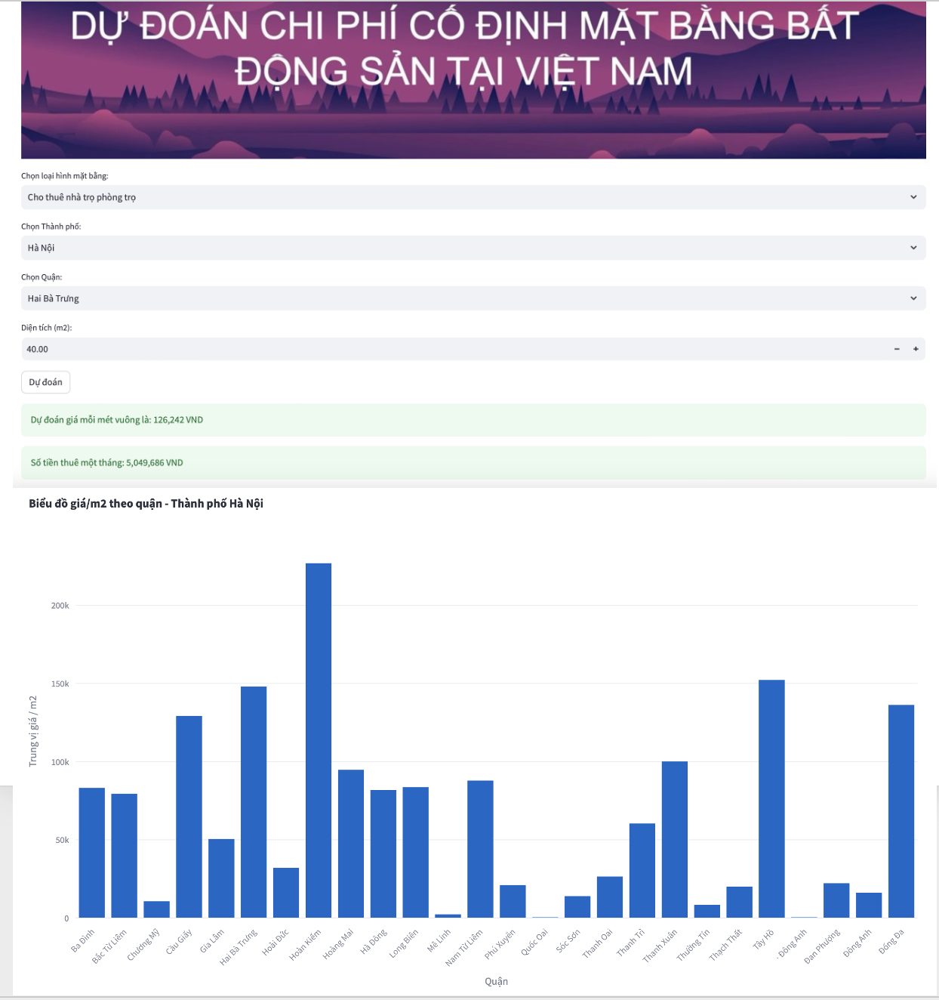

# Crawl data Bất động sản trên các trang web bds lớn phục vụ xác định chi phí thuê văn phòng/kiot/nhà của một cá nhân/nhà buôn/người kinh doanh

## Mục đích
Thư mục code này chứa các thành phần chính để thu thập dữ liệu từ các trang web bất động sản, xây dựng mô hình dự đoán giá thuê nhà / giá mua nhà / giá đất /..., và tạo một ứng dụng giao diện người dùng (GUI) để demo kết quả.
Repo này hiện crawl tại một số trang batdongsan.com.vn, alonhadat, sosanhnha, nhapho.net,... Từ đó xây dựng các pipeline crawl 1-2 tuần / lần cho các mục tiêu của KV như Lending, MI.

## Kết quả
| Price | Area | City | District | Ward | Street| price_per_m2 |
|-------|------|------|----------|------|-------|--------------|
| 250 triệu | 200 m2 | Hà Nội | Hoàn Kiếm | Hàng Bạc | Đinh Tiên Hoàng | 1,250,000 đồng
| 30 triệu | 80 m2 | Hồ Chí Minh | Thủ Đức | Long Thạnh Mỹ | Nguyễn Xiển | 375,000 đồng

## Các File Chính

1. **crawl_ ... .py**: 
   - File này chứa mã nguồn để thu thập dữ liệu từ các trang web bất động sản. Có thể có các hàm để crawl thông tin như giá, diện tích, vị trí, v.v.

2. **clean_ ... .py**:
   - File này clean data từ các nguồn được thu thập, giúp đồng nhất schema giữa các dataframe được thu thập từ các trang web khác nhau

3. **app_prediction.py**:
   - File này là ứng dụng chính có giao diện người dùng sử dụng thư viện Streamlit. Cho phép người dùng nhập dữ liệu và xem dự đoán của mô hình thông qua giao diện đơn giản.

4. **merge&preprocessing**:
   - File này merge các dữ liệu sau khi được clean và đưa vào mô hình Random Forest để dự đoán

   
## Cách Sử Dụng

BƯỚC 1. **Thu thập Dữ liệu (crawl_....py)**:
   - Chắc chắn đã cài đặt các thư viện cần thiết.
   - Chạy các file python `crawl_....py` để bắt đầu quá trình thu thập dữ liệu từ các trang web bất động sản.

BƯỚC 2. **Làm sạch Dữ liệu (clean_ ... .py)**:
   - Chắc chắn đã cài đặt các thư viện cần thiết.
   - Chạy các file python `clean_....py` để bắt đầu quá trình làm sạch dữ liệu đã thu thập từ các trang web bất động sản

BƯỚC 3. **Xây Dựng Mô Hình (merge&preprocessing.py)**:
   - Chắc chắn đã cài đặt các thư viện học máy và học sâu.
   - Chạy python `merge&preprocessing.py` để xây dựng mô hình dự đoán dựa trên dữ liệu đã thu thập.
   - Lưu ý để làm được BƯỚC 3 train mô hình cần có data ở BƯỚC 2

BƯỚC 4. **Chạy Ứng Dụng Giao Diện (app_prediction.py)**:
   - Chắc chắn đã cài đặt Streamlit (`pip install streamlit`).
   - Chạy `streamlit run app_prediction.py` và mở trình duyệt tại địa chỉ được hiển thị để sử dụng ứng dụng giao diện.
   - Lưu ý để làm được BƯỚC 4 cần xong BƯỚC 1 + BƯỚC 2 + BƯỚC 3

## Yêu Cầu Hệ Thống
- Python 3.x
- Các thư viện được liệt kê trong `requirements.txt`

## Người phát triển
Sondn 

## Người mở đường
Huydata <3
